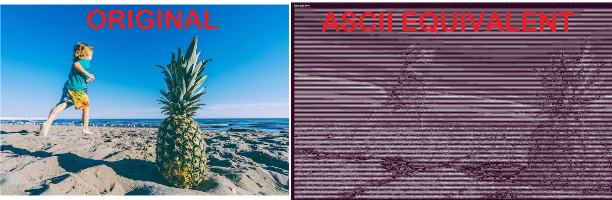

# ASCII Art

This program transforms images into ASCII-art, which basically is to generate an image with characters of the ASCII Table

Here you can see the original example and the output:


## Usave
To use the program you just have to:
* Linux:
```shell
# Install python3 libraries needed
pip install -r requirements.txt
```
```python3
# Runt the app
./art-ascii.py
```
OR
```shell
python3  art-ascii.py
```
